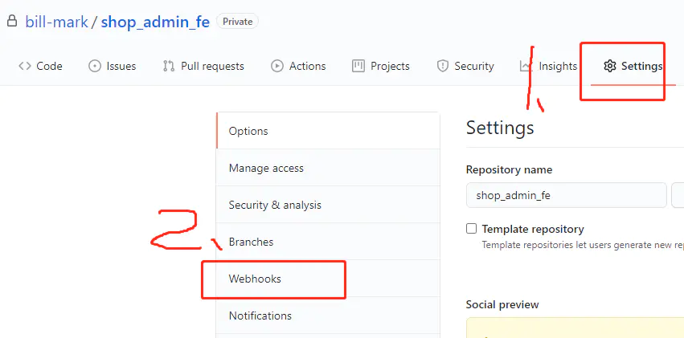
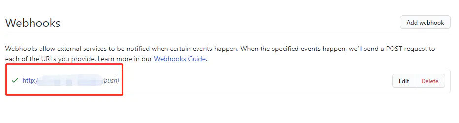
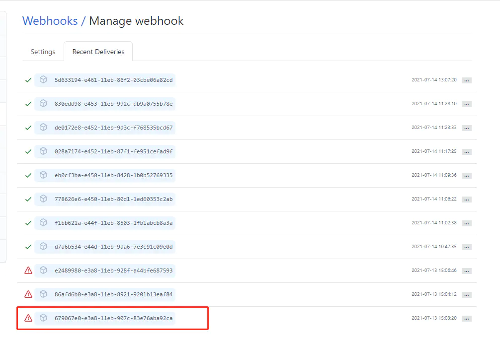
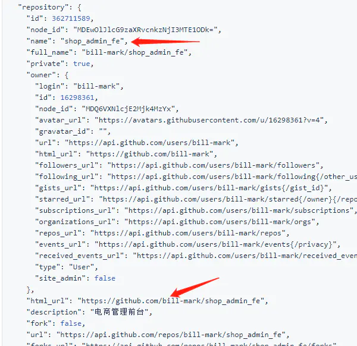
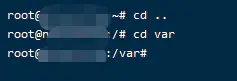
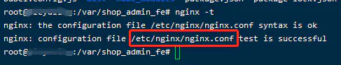
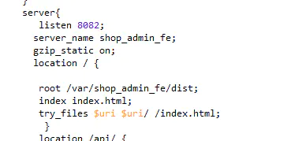
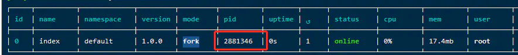

需求:
前端代码提交到GitHub,服务器能监听到提交并自动打包

准备:

1. 服务器:
   云服务器比如阿里云或者公司的能接收外网请求的测试服务器,
   服务器装好nodejs,git,nginx,pm2(选装),yarn(选装)
2. GitHub账户;或者带webhook的gitlab账户
3. 本地通过npm建个前端demo 比如vue项目

逻辑思路:
github对应项目配置一个webhook,该webhook功能为接收到git push请求后会通过post访问一个指定接口.
然后服务端 监听该请求,通过脚本命令更新代码并打包

第一步 GitHub配置webhook
1.github新建一个项目,然后把前端代码提交上去
2.进入到GitHub对应的项目页面,先点击setting,再点击webhook





3.点击addwebhook按钮
4.填写信息
Payload URL 填写服务器公网IP和预留端口号
Content type 选json 如图所示


5.点击add webhook按钮
6.此时 我们的webhook就配置完成了,我们先测下发出的信息是什么样的,

1. 前端demo项目随便改点东西提交上去
   点击我们配置好的webhook

   

选择 recent deliverives按钮


因为服务器还没配置对应的程序用来接收请求,发送消息列表左侧会显示红色警告




8.点一个post请求进去看看什么样子,心里有数
重要的是respository里面的内容




第二步 nginx配置
我们先通过nginx把这个前端服务手动跑起来,再考虑自动发版
博主用的是阿里云 系统是Ubuntu,如果通过apt装的nginx,前端打包后的文件不能放在~下面或者root目录下面,
因为nginx默认没有权限.
这时候你可以给nginx提升权限(不推荐),或者把打包后的文件放在别的目录下面.

1.登录服务器 退出~目录来到系统目录  切换到var目录 没有var目录可以新建一个




2.拉取代码并打包
确认下服务器的sshkey已经加到GitHub上去
装一个npm,这里推荐装yarn  npm版本太新的话install报错
在var目录下git clone xxx 把GitHub上面对应代码done下来,比如博主的项目叫shop_admin_fe
执行下面命令


```bash
cd shop_admin_fe
yarn install
npm run build
```

这时候我们应该能看到打包后的文件,比如vue项目打包文件叫dist


3.nginx配置
本文不是教学nginx 所以简单说下
输入nginx -t 找到配置文件 通过vim打开




配置nginx端口代理




博主是把前端服务配到了8082端口,所以访问服务器公网IP加8082端口即能访问网页

第三步 自动脚本配置 JS+SH
博主配置好的脚本[地址](https://links.jianshu.com/go?to=https%3A%2F%2Fgithub.com%2Fbill-mark%2Ffe-webhook)

思路:nodejs起一个http服务,用来监听github发送的post请求,接收到请求后执行对应的脚本文件

在服务器~目录或者别的目录下新建一个目录  比如叫做fe-webhook
里面创建两个文件index.js  autobuild.sh
也可以在本地电脑通过编辑器建好再传到服务器上
index.js文件内容为


```tsx
const http = require("http");
//var callfile = require("child_process");

const resolvePost = (req) =>
  new Promise((resolve) => {
    let chunk = "";
    req.on("data", (data) => {
      chunk += data;
    });
    req.on("end", () => {
      resolve(JSON.parse(chunk));
    });
  });

  function run_cmd(cmd, args, callback) {
    var spawn = require('child_process').spawn;
    var child = spawn(cmd, args);
    var resp = "";

    child.stdout.on('data', function(buffer) { resp += buffer.toString(); });
    child.stdout.on('end', function() { callback (resp) });
}

http
  .createServer(async (req, res) => {
    console.log("receive request");
    console.log(req.url);
    if (req.method === "POST" && req.url === "/") {
      console.log("if true");
      const data = await resolvePost(req);

      let giturl = data.repository.html_url;

      console.log('next callfile',giturl)

      //callfile.execFile("autobuild.sh", ["giturl", giturl]);

      run_cmd('sh', ['./autobuild.sh'], function(text){ console.log(text) });

      res.end("ok");
    }
    console.log("if else");
  })
  .listen(3020, () => {
    console.log("server is ready");
  });
```

大概代码思路为 引入http child_process模块,监听3020端口的post请求,接收到请求调用autobuild.sh这个脚本文件

autobuild.sh脚本文件编辑


```bash
# 前端在服务器的git地址
WEB_PATH='/var/shop_admin_fe/'

WEB_USER='root'
WEB_USERGROUP='root'

echo "Start"
cd $WEB_PATH
echo `pwd`
echo "pulling source code..."
git fetch --all
git reset --hard origin/main
git pull
echo "next build..."
yarn
npm run build
echo "build end"
#chown -R $WEB_USER:$WEB_USERGROUP $WEB_PATH
#echo "Finished."
```

脚本其实和平时CMD命令差不多 只不过是写在文件里的 可以多次执行,
大概逻辑:
切换到前端代码目录,更新代码,install一遍插件再打包

第四步 启动
这时候我们工作基本完成了 直接node start index.js文件即可
然后前端代码随便更改 push上去就能自动打包了
实际开发中为了能调试 看到JS和脚本打印的东西 ,要用PM2启动JS文件 并监听日志


```css
pm2 start index.js --watch
pm2 monit appid
```

appid是执行完pm2 start index.js --watch会打印一个表单 上面的pid




到此 前端GitHub自动发版就搞定了 可以提交验证下 有问题评论区留言
参考文档 [文档1](https://links.jianshu.com/go?to=https%3A%2F%2Fjuejin.cn%2Fpost%2F6844904148668792839%23heading-23) [文档2](https://links.jianshu.com/go?to=https%3A%2F%2Fjuejin.cn%2Fpost%2F6844903943466647560%23heading-2)


作者：折叠幸福
链接：https://www.jianshu.com/p/64b8ea06c3ab
来源：简书
著作权归作者所有。商业转载请联系作者获得授权，非商业转载请注明出处。
